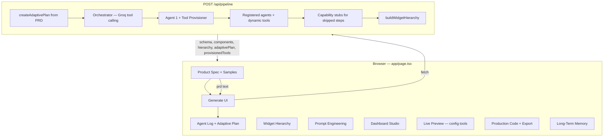

# BridgeView AI

## Problem Statement
Building customized maritime operational dashboards traditionally takes weeks of engineering, requiring deep domain knowledge and specialized UI design. **BridgeView AI** solves this by acting as an autonomous Maritime UI Generator — it reads a product spec (PRD), proposes a widget hierarchy, shows a live dashboard preview driven by your input, and exports production-ready React components in seconds.

## Demo video

[Watch the walkthrough on Loom](https://www.loom.com/share/0f2a684094b94ac294ac40d0cc76db47)

## Team Members & Contributions
* **Daisy Augustine** — Orchestrator & LLM Integration
* **Karthika Krishnan** — UI/UX & Frontend Development
* **Jenifer Deli** — Agent Logic & Prompt Engineering

*(Please update the team members list above with actual names and contributions)*

---

Built with Next.js, Groq (Llama 3.x), an **adaptive agent orchestrator**, config-driven tools, prompt engineering, and session + IndexedDB memory.

---

## Features

| Feature | Description |
|---------|-------------|
| **Spec input** | Paste a maritime PRD or load preset samples |
| **Adaptive pipeline** | PRD-tailored plan — agents and tools grow or shrink per requirement |
| **Tool Provisioner** | After requirements are extracted, dynamically registers PRD-specific tools from catalog + LLM |
| **7-agent pipeline + BridgeView** | Requirement analysis → tool provisioning → classification → viz selection → feature discovery → layout → schema → React generation → UX + maritime review |
| **Config-driven tools** | Widget mapping, viz rules, feature discovery, and design templates in `config/maritime/*.json` |
| **LLM tool fallback** | Groq enriches sparse config matches (server-side only) |
| **Model fallback chain** | Auto-switches Groq models on rate limits (`llama-3.3-70b` → `llama-3.1-70b` → `llama-3.1-8b` → `gemma2-9b`) |
| **Widget hierarchy** | Visual tree of proposed dashboard structure |
| **Prompt engineering** | Inspect system/user prompts sent to the LLM |
| **Live preview** | Dynamic preview from PRD (config-only, no API call) |
| **StackBlitz IDE Export** | Launch generated UI in a browser-based Vite + Tailwind IDE |
| **Dashboard Studio** | Drag-and-drop reorder, hide/show widgets |
| **Code export** | Copy or download TSX (single file, all files, bundle + index) |
| **Long-term memory** | Saves runs to IndexedDB (PRD, schema, widgets) |
| **Themes** | Ocean / Harbor UI themes |

### Recent Architecture Improvements

- **Adaptive Grid Layout:** Uses a responsive 12-column CSS grid (`col-span` dynamically mapped via heuristics in StackBlitz and Live Preview). Automatically constraints generated SVG charts (`min-w-0 overflow-hidden`) to prevent layout blowout.
- **Robust Visualization Hand-off:** Fixed schema mapping so **Agent 5** properly receives `visualization` and `archetype` instructions from **Agent 3**, resulting in rich custom SVGs instead of standard fallback cards.
- **Strict Canonical Wireframes:** Removed brittle regex matching from `lib/preview/curated-widgets.ts`. Custom widgets (e.g., `FuelPriceTracker`) no longer incorrectly fallback to hardcoded domains (e.g., `FuelGaugeCards`), ensuring the Live Preview accurately reflects generated vs. standard components.
- **Unified StackBlitz Preview:** Streamlined UX by consolidating to a single, always-functional "Open in StackBlitz" button in the Export tab. This dynamically injects the true AI-generated React components and extracts the exact PRD dashboard title, providing a 100% accurate, interactive React environment without relying on limited in-browser transpilers.
- **Native Babel Live Preview Sandbox:** Built a secure in-browser execution sandbox (`@babel/standalone` + `new Function`) that dynamically compiles AI-generated React TSX code into the Live Preview tab. Configured with forced CommonJS modules, classic JSX runtime, and a regex import-scrubber to prevent Vite and module resolution crashes caused by AI hallucinations.

---

## Full application flow



### Step-by-step (user journey)

1. **Enter spec** — Type or paste a PRD, or click a **sample spec** chip.
2. **Live preview updates** — As you edit the PRD, config-driven tools detect widgets and parse vessel/route/fuel context (`lib/preview/parse-prd.ts`) — no API call.
3. **Generate UI** — Click **Generate UI** to run the adaptive pipeline.
4. **Adaptive plan** — `createAdaptivePlan(prd)` selects which agents and tools are needed; skipped steps are recorded in the agent log.
5. **Orchestrator** — Groq invokes planned agents/tools in dependency order (with deterministic fallback if models are unavailable).
6. **Tool Provisioner** — Runs after Agent 1; matches `tool-catalog.json`, activates missing baseline tools, and optionally asks Groq for up to 4 delegated tools.
7. **Essential path** — Always runs: requirement analysis → schema assembly → React generation. `tool_provisioner` is always scheduled after requirements are extracted. Optional agents (BridgeView, layout, UX review, maritime expert, etc.) run only when PRD triggers match.
8. **UI updates** — Widget Hierarchy, Prompt Engineering, Studio, Live Preview, Production Code. Response includes `adaptivePlan` and `provisionedTools` showing what ran vs was skipped.
9. **Export** — Copy or download `.tsx` files for use in your app.

---

## Adaptive orchestration

The pipeline is **not** a fixed sequence. It is planned from the PRD, then executed by a model-driven orchestrator.

### How planning works

| Stage | Location | What it does |
|-------|----------|--------------|
| **Config triggers** | `config/maritime/pipeline-capabilities.json` | Regex `triggers` / `antiTriggers` per agent and tool |
| **Baseline plan** | `lib/orchestration/pipeline-planner.ts` | Selects capabilities; ensures dependency closure |
| **LLM refinement** | Same (optional) | Groq can add/remove optional capabilities (`response_format: json_object`) |
| **Re-plan** | After Agent 1 | Refines plan using extracted metrics, domain, priority; always inserts `tool_provisioner` |
| **Tool provisioning** | `lib/orchestration/tool-provisioner.ts` | Catalog match → baseline activation → optional LLM suggestions |

### Essential vs optional

| Always runs | Optional (PRD-triggered) |
|-------------|--------------------------|
| `requirement_analyzer` | `data_classifier` |
| `tool_provisioner` (after Agent 1) | `visualization_selector` |
| `schema_builder` | `bridgeview_intelligence` |
| `react_generator` | `layout_planner` |
| | `ux_reviewer` |
| | `maritime_expert` |

**Baseline tools** (PRD-selected): `map_widgets`, `recommend_visualizations`, `feature_discovery`, `get_design_system_template`

**Dynamic tools** — the **Tool Provisioner** agent can add more at runtime from `config/maritime/tool-catalog.json` and LLM suggestions (delegates to safe base handlers).

Skipped upstream agents are **stubbed** automatically (`lib/orchestration/capability-stubs.ts`) so downstream steps still succeed.

### Registered agents

| ID | Display | Role |
|----|---------|------|
| `requirement_analyzer` | AGENT 1 | Parse PRD → entities, metrics, domain |
| `tool_provisioner` | TOOL PROVISIONER | Analyze PRD gaps → register additional tools dynamically |
| `data_classifier` | AGENT 2 | Classify metrics (Spatial, Temporal, KPI, …) |
| `visualization_selector` | AGENT 3 | Map metrics → widgets and archetypes |
| `bridgeview_intelligence` | BRIDGEVIEW | Feature discovery and widget expansion |
| `layout_planner` | AGENT 4 | Dashboard zones and placement |
| `schema_builder` | SCHEMA | Assemble `ParsedSchema` |
| `react_generator` | AGENT 5 | Generate TSX per widget |
| `ux_reviewer` | AGENT 6 | UX and accessibility validation |
| `maritime_expert` | AGENT 7 | Maritime domain review |

Agents register in `lib/orchestration/agent-definitions.ts`. The orchestrator in `lib/orchestration/orchestrator.ts` dispatches them via Groq tool calling.

---

## Config-driven tools

Tool **logic** lives in JSON config, not hardcoded TypeScript rules:

| Config file | Purpose |
|-------------|---------|
| `config/maritime/widget-mapper.json` | Widget catalog, keyword map, aliases |
| `config/maritime/visualization-rules.json` | Field → visualization recommendations |
| `config/maritime/feature-discovery.json` | Domain rules, vessel intelligence, predictive patterns |
| `config/maritime/widget-design-system.json` | Archetype templates (table, kpi, gauge, route-map, …) |
| `config/maritime/pipeline-capabilities.json` | PRD triggers for adaptive agent/tool selection |
| `config/maritime/tool-catalog.json` | Extensible tool templates with `delegateTo` base handlers |

### Tool Provisioner (dynamic tool growth)

After Agent 1 extracts requirements, **Tool Provisioner** runs:

1. **Catalog match** — PRD keywords → templates in `tool-catalog.json` (e.g. `emissions_analyzer` → `feature_discovery`)
2. **Baseline activation** — adds missing base tools when PRD keywords match but plan omitted them
3. **LLM suggestions** — Groq proposes up to 4 new tools, each delegating to a registered base handler (no arbitrary code execution)

New tools are registered per pipeline run via `registerDynamicTool()` and appear in `provisionedTools` in the API response.

`source` values: `catalog` (keyword match), `config` (baseline tool activated), `llm` (Groq suggestion).

### LLM JSON parsing

Structured LLM responses (pipeline planner, tool provisioner, tool fallback) use:

- `response_format: { type: 'json_object' }` on Groq calls
- `lib/parse-llm-json.ts` — extracts JSON from prose or markdown when models return mixed text

If parsing fails, the pipeline **degrades gracefully**: config-only plan for the planner, catalog-only provisioning for the tool provisioner.

### Sync vs server paths

| Context | Path | LLM |
|---------|------|-----|
| **Live preview** (browser) | `lib/tools/*.ts` sync APIs | Config only |
| **Pipeline** (server) | `lib/tools/*.server.ts` | Config + LLM fallback |

Server modules use `import 'server-only'` so Groq is never bundled into the client.

---

## Agent pipeline (technical)

### Entry point

`app/api/pipeline/route.ts` — `POST` body: `{ "prd": "..." }`

**Response highlights:**

```json
{
  "schema": { ... },
  "components": { "FuelGaugeCards": "..." },
  "hierarchy": [ ... ],
  "agentTrace": [ ... ],
  "adaptivePlan": {
    "agents": ["requirement_analyzer", "tool_provisioner", "visualization_selector", "schema_builder", "react_generator"],
    "tools": ["recommend_visualizations", "emissions_analyzer"],
    "skipped": [{ "id": "maritime_expert", "type": "agent", "reason": "..." }],
    "rationale": "Adaptive plan: 5 agents, 2 tools, 4 skipped · 1 tool(s) provisioned for this PRD",
    "provisionedTools": [
      {
        "id": "emissions_analyzer",
        "description": "Emissions and CII regulatory tracking",
        "delegateTo": "feature_discovery",
        "reason": "PRD matched catalog alias for emissions_analyzer",
        "source": "catalog"
      }
    ]
  },
  "provisionedTools": [ ... ]
}
```

### Groq model fallback

`lib/groq-chat.ts` tries models in order on rate limits or unavailability:

1. `llama-3.3-70b-versatile`
2. `llama-3.1-70b-versatile`
3. `llama-3.1-8b-instant`
4. `gemma2-9b-it`

Override via `.env.local`:

```env
GROQ_MODEL_FALLBACK_CHAIN=llama-3.1-8b-instant,gemma2-9b-it
```

### Supported widgets (whitelist)

`VoyageProgressTracker`, `FuelGaugeCards`, `CrewCertificationStatus`, `AlertPanel`, `WeatherWidget`, `EngineMonitor`, `KPIDashboard` (+ extended widgets from viz rules, e.g. `AISLiveFeed`, `SensorStreamPanel`)

---

## Project structure

```
app/
  page.tsx                      # Main dashboard UI
  api/pipeline/route.ts         # Adaptive pipeline entry
  layout.tsx
  globals.css

config/maritime/
  widget-mapper.json            # Widget keywords and catalog
  visualization-rules.json      # Viz recommendation rules
  feature-discovery.json        # Domain coverage rules
  widget-design-system.json     # Archetype templates
  pipeline-capabilities.json    # Adaptive plan triggers
  tool-catalog.json             # Dynamic tool templates (delegateTo base handlers)

lib/
  parse-llm-json.ts             # Robust JSON extraction from LLM responses
  orchestration/
    orchestrator.ts             # Model-driven pipeline loop
    pipeline-planner.ts         # PRD → adaptive plan
    tool-provisioner.ts         # Dynamic tool registration per PRD
    agent-definitions.ts        # Agent registry
    tool-definitions.ts         # Baseline tool registry
    capability-stubs.ts         # Stubs for skipped agents
    registry.ts                 # Dispatch + dependency guards
    schema-builder.ts           # ParsedSchema assembly
  agents/
    agent1-requirement-analyzer.ts
    agent2-data-classifier.ts
    agent3-visualization-selector.ts
    agent4-layout-planner.ts
    agent5-react-generator.ts
    agent6-ux-reviewer.ts
    agent7-maritime-expert.ts
    bridgeview-intelligence.ts
    run-pipeline.ts             # Thin wrapper → orchestrator
  groq-chat.ts                  # Model fallback chain
  prompts/
    maritime-prompts.ts
  tools/
    widget-mapper.ts            # Sync (client-safe)
    widget-mapper.server.ts     # Async + LLM fallback
    visualization-recommender.ts
    visualization-recommender.server.ts
    feature-discovery.ts
    feature-discovery.server.ts
    widget-design-system.ts
    widget-design-system.server.ts
    config-loader.ts            # JSON config access
    llm-fallback.ts             # Groq enrichment helpers
    semantic-visualization.ts   # Semantic viz assignment for Agent 3
    registry.ts                 # Component code registry (per run)
  preview/
    parse-prd.ts
    widget-previews.tsx
    hierarchy.ts
    stackblitz-builder.ts
  export/
    code-export.ts
  memory/
    session.ts
    persistent.ts
  input/
    prd-samples.ts
  anthropic.ts                  # Groq client

components/
  prompt-panel.tsx
  hierarchy-tree.tsx
  dashboard-studio.tsx
  code-export-bar.tsx
  prd-sample-picker.tsx
  viz-recommendations-panel.tsx
  feature-discovery-panel.tsx
```

---

## Getting started

### Prerequisites

- Node.js 18+
- [Groq API key](https://console.groq.com/)

### Install

```bash
npm install
```

### Environment

An example environment file is provided. Copy it to create your local environment file:

```bash
cp .env.example .env.local
```

Then, open `.env.local` and add your actual API keys:

```env
GROQ_API_KEY=your_groq_api_key_here
GEMINI_API_KEY=your_gemini_api_key_here

# Optional overrides...
```

### Run locally

```bash
npm run dev
```

Open [http://localhost:3000](http://localhost:3000).

### Build for production

```bash
npm run build
npm start
```

---

## Example PRD

```
Build a vessel monitoring dashboard for MV Atlantic Star.

Required widgets:
- Voyage progress tracker with route legs, ETA, and distance remaining
- Fuel gauge cards for HFO and MDO tanks with consumption rates
- Crew certification status panel (STCW compliance and expiry)
- Alert panel for critical machinery and navigation warnings

Layout: dashboard-grid. Priority: safety-critical.
```

A rich PRD like this typically activates most agents, BridgeView, and visualization tools. A minimal PRD (e.g. *"single fuel gauge widget"*) runs a shorter plan with several agents skipped.

Additional samples: **Sample specs** in the UI (`lib/input/prd-samples.ts`).

---

## Extending the system

### Add a widget keyword

Edit `config/maritime/widget-mapper.json` — add to `keywordMap`.

### Add a visualization rule

Edit `config/maritime/visualization-rules.json` — add to `rules`.

### Add an agent to the adaptive pipeline

1. Implement the agent in `lib/agents/`.
2. Register in `lib/orchestration/agent-definitions.ts` with `registerAgent({ id, requires, produces, run })`.
3. Add triggers in `config/maritime/pipeline-capabilities.json`.

### Add a baseline tool

1. Implement logic in `lib/tools/` (sync + `.server.ts` if LLM fallback needed).
2. Register in `lib/orchestration/tool-definitions.ts`.
3. Add triggers in `config/maritime/pipeline-capabilities.json`.

### Add a dynamic tool (no code deploy)

Add a template to `config/maritime/tool-catalog.json`:

```json
{
  "id": "ballast_monitor",
  "aliases": ["ballast", "stability", "heel"],
  "delegateTo": "feature_discovery",
  "description": "Ballast and stability monitoring for tankers"
}
```

The Tool Provisioner registers it automatically when the PRD mentions those aliases. For novel tools, the LLM can suggest new `id` values that delegate to existing base handlers.

---

## Memory

| Layer | Storage | Contents |
|-------|---------|----------|
| **Session** | Zustand (`lib/memory/session.ts`) | PRD, schema, components, logs, preview widgets, prompts |
| **Persistent** | IndexedDB (`lib/memory/persistent.ts`) | Historical runs: PRD, schema, widget list, timestamp |

---

## Code export

From the **Production Code** panel:

- **Copy code** — current widget with React import header
- **Download** — single `.tsx` file
- **Export all** — bundled file with all components
- **Bundle + index** — components + `MaritimeDashboard.tsx` layout shell

Implementation: `lib/export/code-export.ts`, `components/code-export-bar.tsx`

---

## Tech stack

- **Framework:** Next.js 16 (App Router)
- **UI:** React 19, Tailwind CSS 4
- **State:** Zustand
- **LLM:** Groq SDK with model fallback chain
- **Orchestration:** Groq tool calling + adaptive PRD planning
- **Persistence:** IndexedDB via `idb`

---

## Troubleshooting

| Issue | Fix |
|-------|-----|
| Pipeline fails immediately | Check `GROQ_API_KEY` in `.env.local` and restart dev server |
| Rate limit / TPD exceeded | System auto-tries fallback models; if all fail, deterministic pipeline fallback still runs |
| `SyntaxError: ... is not valid JSON` in logs | Fixed via `parse-llm-json.ts`; pipeline falls back to config plan / catalog tools. Set `DISABLE_ADAPTIVE_LLM_PLANNER=true` or `DISABLE_TOOL_PROVISIONER_LLM=true` to skip LLM refinement entirely |
| `server-only` / Groq client error in browser | Client must not import `.server.ts` or `llm-fallback.ts` — use sync tool paths in preview |
| Agent log shows many `skipped` entries | Expected for minimal PRDs — check `adaptivePlan` in API response |
| `previewWidgets.filter is not a function` | Refresh page; widgets normalized via `asWidgetArray()` |
| Live preview runtime error | Regenerate UI; Agent 5 falls back to curated templates on LLM failure |

### Git SSH (dual GitHub accounts)

Use host aliases in `~/.ssh/config`:

```ssh-config
Host github.com-thinkpalm
  HostName github.com
  User git
  IdentityFile ~/.ssh/id_ed25519_thinkpalm
  IdentitiesOnly yes
```

Set remote:

```bash
git remote set-url origin git@github.com-thinkpalm:karthikakthinkpalm/REPO_NAME.git
```

Test: `ssh -T git@github.com-thinkpalm`

---

## License

Private / team project — see repository owner for usage terms.
