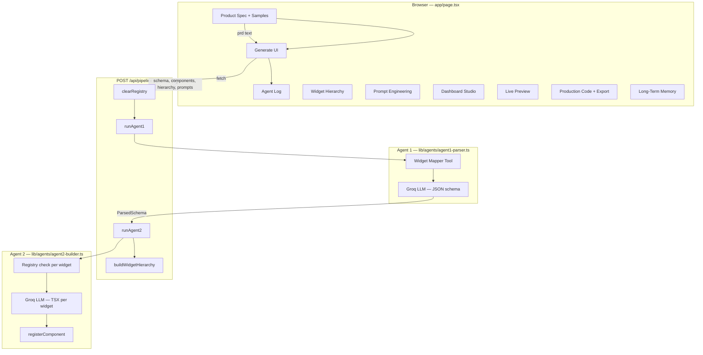

# BridgeView AI

**Maritime UI Generator** — reads a product spec (PRD), proposes a widget hierarchy, shows a live dashboard preview driven by your input, and exports production-ready React components.

Built with Next.js, Groq (Llama 3.3), and a two-agent pipeline with prompt engineering, tool grounding, and session + IndexedDB memory.

---

## Features

| Feature | Description |
|---------|-------------|
| **Spec input** | Paste a maritime PRD or load preset samples |
| **Agent 1 — PRD Parser** | Parses spec → JSON schema (widgets, layout, priority) |
| **Agent 2 — UI Builder** | Generates one `.tsx` component per widget |
| **Widget hierarchy** | Visual tree of proposed dashboard structure |
| **Prompt engineering** | Inspect system/user prompts sent to the LLM |
| **Live preview** | Dynamic preview from PRD (vessel, widgets, data) |
| **Dashboard Studio** | Drag-and-drop reorder, hide/show widgets |
| **Code export** | Copy or download TSX (single file, all files, bundle + index) |
| **Long-term memory** | Saves runs to IndexedDB (PRD, schema, widgets) |
| **Themes** | Ocean / Harbor UI themes |

---

## Full application flow



### Step-by-step (user journey)

1. **Enter spec** — Type or paste a PRD in the left panel, or click a **sample spec** chip (MV Atlantic Star, Bridge navigation, Engine room, etc.).
2. **Live preview updates** — As you edit the PRD, the app detects widgets and parses vessel/route/fuel/alert context (`lib/preview/parse-prd.ts`) for the preview tab (no API call required).
3. **Generate UI** — Click **Generate UI** to run the pipeline.
4. **Agent 1** runs:
   - **Tool:** `mapWidgets(prd)` — keyword → widget names (`lib/tools/widget-mapper.ts`).
   - **LLM:** Groq `llama-3.3-70b-versatile` with engineered prompts (`lib/prompts/maritime-prompts.ts`).
   - **Output:** `ParsedSchema` — `domain`, `widgets[]`, `layout`, `priority`.
5. **Agent 2** runs (per widget in schema):
   - **Tool:** `checkExists` / `registerComponent` (`lib/tools/registry.ts`).
   - **LLM:** One Groq call per widget → React + TypeScript + Tailwind TSX.
   - **Output:** `Record<widgetName, sourceCode>`.
6. **UI updates** — Center tabs: **Widget Hierarchy**, **Prompt Engineering**, **Studio**, **Live Preview**. Right panel: component list + code viewer + export bar. History saved to IndexedDB.
7. **Studio** — Reorder or hide widgets; preview reflects changes immediately.
8. **Export** — Copy code or download `.tsx` files for use in your app.

---

## Agent pipeline (technical)

### Entry point

`app/api/pipeline/route.ts` — `POST` body: `{ "prd": "..." }`

### Agent 1 — PRD Parser

| Item | Location |
|------|----------|
| Implementation | `lib/agents/agent1-parser.ts` |
| Tool (pre-LLM) | `lib/tools/widget-mapper.ts` |
| Prompts | `lib/prompts/maritime-prompts.ts` → `buildAgent1SystemPrompt`, `buildAgent1UserPrompt` |
| Model | Groq `llama-3.3-70b-versatile`, temperature `0.1` |
| Output | JSON schema + `prompts[]` for audit tab |

**Supported widgets (whitelist):**

`VoyageProgressTracker`, `FuelGaugeCards`, `CrewCertificationStatus`, `AlertPanel`, `WeatherWidget`, `EngineMonitor`, `KPIDashboard`

### Agent 2 — UI Builder

| Item | Location |
|------|----------|
| Implementation | `lib/agents/agent2-builder.ts` |
| Prompts | Per-widget user prompt with domain/layout/priority hints |
| Model | Groq `llama-3.3-70b-versatile`, temperature `0.7` |
| Output | Map of component name → TSX source |

### Prompt engineering tab

Shows every system/user message sent to Groq, tagged with techniques:

- Role assignment  
- Output format constraint (JSON / TSX only)  
- Tool grounding (widget whitelist)  
- Structural few-shot (schema exemplar)  
- Domain context injection  
- Negative constraints (no markdown fences, etc.)

---

## UI layout

| Panel | Purpose |
|-------|---------|
| **Product Spec** | PRD textarea, sample chips, Generate button, memory metrics, agent log |
| **Widget Hierarchy** | Tree from Agent 1 schema; click widget → jump to preview |
| **Prompt Engineering** | Expandable prompt records from both agents |
| **Studio** | Drag-and-drop widget order, hide/show toggles |
| **Live Preview** | PRD-driven widget cards (updates as spec changes) |
| **Production Code** | File list, syntax view, copy/download export |
| **Long-Term Memory** | Past runs from IndexedDB; click to reload PRD |

---

## Project structure

```
app/
  page.tsx                 # Main dashboard UI
  api/pipeline/route.ts    # Orchestrates Agent 1 → Agent 2
  layout.tsx
  globals.css

lib/
  agents/
    agent1-parser.ts       # PRD → schema
    agent2-builder.ts      # schema → TSX components
  prompts/
    maritime-prompts.ts    # Centralized prompt engineering
  tools/
    widget-mapper.ts       # Keyword detection + normalization
    registry.ts            # In-memory component registry (per run)
  preview/
    parse-prd.ts           # PRD → live preview data
    preview-context.tsx    # React context for preview widgets
    widget-previews.tsx    # Preview card components
    hierarchy.ts           # Widget tree builder
  export/
    code-export.ts         # Download / copy utilities
  memory/
    session.ts             # Zustand session state
    persistent.ts          # IndexedDB history
  input/
    prd-samples.ts         # Preset PRD templates
  anthropic.ts               # Groq client (GROQ_API_KEY)

components/
  prompt-panel.tsx
  hierarchy-tree.tsx
  dashboard-studio.tsx
  code-export-bar.tsx
  prd-sample-picker.tsx
```

---

## Getting started

### Prerequisites

- Node.js 18+
- [Groq API key](https://console.groq.com/)

### Install

```bash
npm install
```

### Environment

Create `.env.local` in the project root:

```env
GROQ_API_KEY=your_groq_api_key_here
```

### Run locally

```bash
npm run dev
```

Open [http://localhost:3000](http://localhost:3000).

### Build for production

```bash
npm run build
npm start
```

---

## Example PRD

```
Build a vessel monitoring dashboard for MV Atlantic Star.

Required widgets:
- Voyage progress tracker with route legs, ETA, and distance remaining
- Fuel gauge cards for HFO and MDO tanks with consumption rates
- Crew certification status panel (STCW compliance and expiry)
- Alert panel for critical machinery and navigation warnings

Layout: dashboard-grid. Priority: safety-critical.
```

Additional samples are available in the UI under **Sample specs** (`lib/input/prd-samples.ts`).

---

## Memory

| Layer | Storage | Contents |
|-------|---------|----------|
| **Session** | Zustand (`lib/memory/session.ts`) | PRD text, schema, components, logs, preview widgets, hidden widgets, prompts |
| **Persistent** | IndexedDB (`lib/memory/persistent.ts`) | Historical runs: PRD, schema, widget list, timestamp |

---

## Code export

From the **Production Code** panel:

- **Copy code** — current widget with React import header  
- **Download** — single `.tsx` file  
- **Export all** — bundled file with all components  
- **Bundle + index** — components + `MaritimeDashboard.tsx` layout shell  

Implementation: `lib/export/code-export.ts`, `components/code-export-bar.tsx`

---

## Tech stack

- **Framework:** Next.js 16 (App Router)  
- **UI:** React 19, Tailwind CSS 4  
- **State:** Zustand  
- **LLM:** Groq SDK (`llama-3.3-70b-versatile`)  
- **Persistence:** IndexedDB via `idb`  

---

## Troubleshooting

| Issue | Fix |
|-------|-----|
| Pipeline fails immediately | Check `GROQ_API_KEY` in `.env.local` and restart dev server |
| `previewWidgets.filter is not a function` | Refresh page; widgets are normalized via `asWidgetArray()` |
| Git push denied (wrong GitHub user) | Use SSH remote: `git@github.com-thinkpalm:USER/REPO.git` — see SSH setup below |
| Live preview looks static | Edit PRD or load a sample; preview parses spec client-side before pipeline runs |

### Git SSH (dual GitHub accounts)

Use host aliases in `~/.ssh/config`:

```ssh-config
Host github.com-thinkpalm
  HostName github.com
  User git
  IdentityFile ~/.ssh/id_ed25519_thinkpalm
  IdentitiesOnly yes
```

Set remote:

```bash
git remote set-url origin git@github.com-thinkpalm:karthikakthinkpalm/REPO_NAME.git
```

Test: `ssh -T git@github.com-thinkpalm`

---

## License

Private / team project — see repository owner for usage terms.
